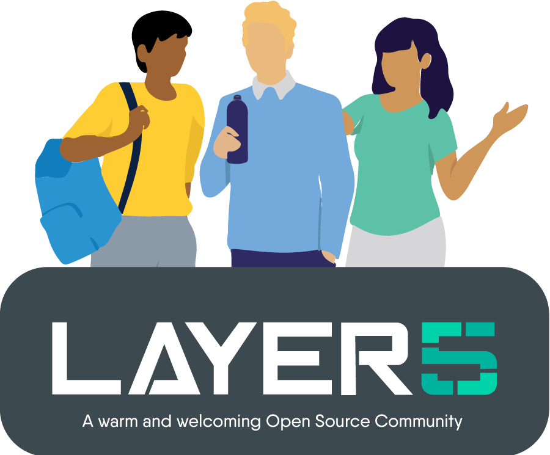

# Sistent Design System

The Sistent Design System from Layer5 provides the open source building blocks to design and implement consistent, accessible, and delightful product experiences.

### Packages

Design System components in React, usually built with Vite.

List of npm packages:

- `@layer5/sistent-components`
- `@layer5/sistent-svg`

### Brand

- Layer5 Brand Guide ([PDF](https://layer5.io/brand/brand-guide.pdf))
- [Layer5 Logos](https://layer5.io/company/brand) (more assets available in shared Community drive).

## Packages

- Design System components in React.js

### Prerequisites

Before you begin, ensure you have the following installed on your system:

- Node.js
- Yarn

### How to get started

Use `corepack enable` to go ahead and install yarn.

1. Install `yarn@3.6.3`
2. Use `yarn` to install dependencies from the root of this project.

<div>&nbsp;</div>

### Installation

To set up the project, run the following command to install dependencies:

```
setup:
	yarn install
```

To build the project, you can use the following command:

```
build: install
	yarn run build-all
```

To check if your code meets the formatting standards, you can run:

```
format-check:
	yarn run format:check
```

To automatically fix formatting issues, you can run

```
format-fix:
	yarn run format:write
```

## Join the Layer5 community!

<a name="contributing"></a><a name="community"></a>
Our projects are community-built and welcome collaboration. 👍 Be sure to see the <a href="https://docs.google.com/document/d/17OPtDE_rdnPQxmk2Kauhm3GwXF1R5dZ3Cj8qZLKdo5E/edit">Layer5 Community Welcome Guide</a> for a tour of resources available to you and jump into our <a href="http://slack.layer5.io">Slack</a>!

<p style="clear:both;">
<a href ="https://layer5.io/community/meshmates"></a>
<h3>Find your MeshMate</h3>

<p>MeshMates are experienced Layer5 community members, who will help you learn your way around, discover live projects and expand your community network. 
Become a <b>Meshtee</b> today!</p>

Find out more on the <a href="https://layer5.io/community">Layer5 community</a>. <br />
<br /><br /><br /><br />

</p>

<div>&nbsp;</div>

<a href="https://slack.meshery.io">

<picture align="right">
  <source media="(prefers-color-scheme: dark)" srcset=".github/readme/images//slack-dark-128.png"  width="110px" align="right" style="margin-left:10px;margin-top:10px;">
  <source media="(prefers-color-scheme: light)" srcset=".github/readme/images//slack-128.png" width="110px" align="right" style="margin-left:10px;padding-top:5px;">
  
</picture>
</a>

<a href="https://meshery.io/community"></a>

<p>
✔️ <em><strong>Join</strong></em> any or all of the weekly meetings on <a href="https://meet.layer5.io">community calendar</a>.<br />
✔️ <em><strong>Watch</strong></em> community <a href="https://www.youtube.com/playlist?list=PL3A-A6hPO2IMPPqVjuzgqNU5xwnFFn3n0">meeting recordings</a>.<br />
✔️ <em><strong>Access</strong></em> the Community Drive by completing a community <a href="https://layer5.io/newcomer">Member Form</a>.<br />
✔️ <em><strong>Discuss</strong></em> in the <a href="https://discuss.layer5.io">Community Forum</a>.<br />
✔️<em><strong>Explore more</strong></em> in the <a href="https://layer5.io/community/handbook">Community Handbook</a>.<br />
</p>
<p align="center">
<i>Not sure where to start?</i> Grab an open issue with the <a href="https://github.com/issues?q=is%3Aopen+is%3Aissue+archived%3Afalse+org%3Alayer5io+org%3Ameshery+org%3Alayer5labs+org%3Aservice-mesh-performance+org%3Aservice-mesh-patterns+label%3A%22help+wanted%22+">help-wanted label</a>.</p>
