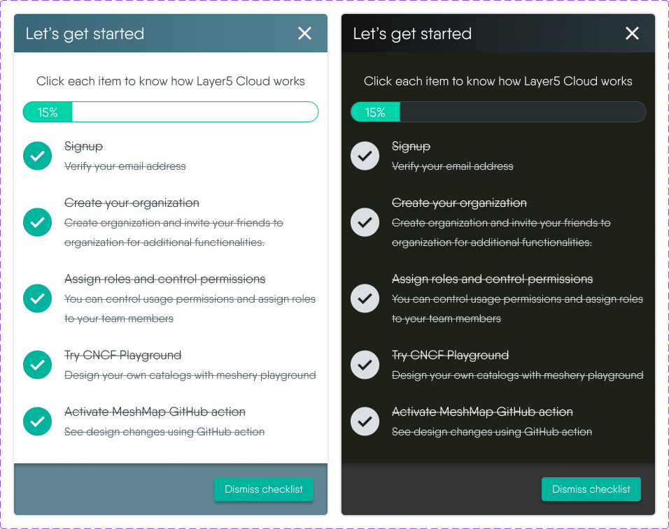

# [Sistent](https://design.layer5.io) UX Design System > Foundations > Colors

Layer5's UI offers a variety of different color modes. Every pattern in Sistent is built to work across all color modes out of the box.

When designing product interfaces in Figma, we recommend using light mode. This is best because the Meshery Figma components are only available in light mode.
To preview your work in other modes, use the [Figma color mode plugin](https://www.figma.com/community/plugin/992128487074360945/Change-Color-Mode).

## How to use color for product UI

Sistent delivers colors in the form of [design variables](https://design.layer5.io/foundations/colors). Design variables are a layer of abstraction that allows better maintainability, consistency and easy theming.

For example use `bg-default` for the background of the page and `fg-default` for the text color. If the user changes to dark mode, the underlying color that those variables reference change, but the variables names stay the same.

### Color design variables are grouped based on their purpose:

- **Presentational:** To represent a color. For example, the color steps in the Sistent scale are named by color and lightness, such as `core.keppel.5`. These design tokens don't support color modes.
- **Functional:** To convey a meaning or a state. For example, from a functional perspective the color green is used to reinforce positive messaging. In a functional system, green design variables are named with the suffix `.success`.
- **Component:** To represent a specific use case. For example, `button.bg` references from the system to be used as the background of a button component.

As the system grows, it will provide more APIs that fit different color needs. Check the [Sistent Foundations](https://github.com/layer5io/sistent/releases/) repository to follow along as we release new design variables and systems.

_Note: This combined specification integrates the information from both provided design system specifications regarding empty state patterns under the [Sistent](https://design.layer5.io) UX Design System._
